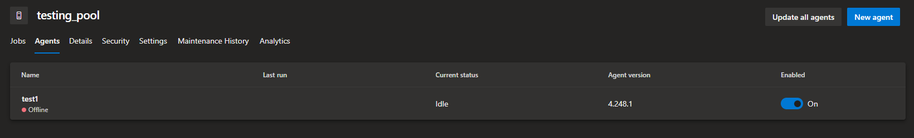
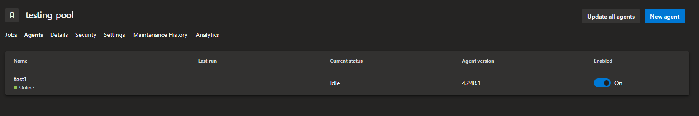

# Azure DevOps agent registration automation (with SPN auth)

## Overview

This repository automates the registration of Azure DevOps agents in docker containers with service principal (`sp`) Authentication.

## Background

According to Microsoft documentation, an Azure DevOps personal access token (PAT) is the only way which is documented to register a docker container in an unattended way (see <a href=#references>references</a>). However, we show that it is possible to use other authentication options to register an Azure DevOps agent in an automated fashion.

## Prerequisites

The **pre-requisites include**:

1. **An agent pool**: This is the pool which the agent will be registered to.
1. **An app registation**: This needs to be given `Administrator` role in the Azure DevOps organisation over the **agent pool**.

## How to use the repository

1. Build the docker file with the following command (replacing values with your own).

   ```bash
   docker build \
       -f ./Dockerfile \
       -t test-image:one \
       --build-arg "ORG_NAME=contosorg" \
       --build-arg "CLIENT_ID=XXXXXXXX-XXXX-XXXX-XXXX-XXXXXXXXXXXX" \
       --build-arg "CLIENT_SECRET=XXXXXXXXXXXXXXXXXXXXXXXXXXXXXXXXXXXXXXXX" \
       --build-arg "TENANT_ID=XXXXXXXX-XXXX-XXXX-XXXX-XXXXXXXXXXXX" \
       --build-arg "AGENT_POOL_NAME=testing_pool" \
       --build-arg "AGENT_NAME=test1" \
       --build-arg "AGENT_WORKING_DIRECTORY=/azdo-agent-dir" \
       --no-cache .
   ```

   After successful build, you should be able to see your agent being registered on the Azure DevOps portal:

   

1. Run the container with the following command:

   ```bash
   docker run -d test-image:one
   ```

   After successful running, you should be able to see your agent online:

   

1. To un-register your agent, run the following commands:

   ```bash
   docker exec -it $(docker ps -a | awk '{print $1}' | tail -n1) bash
   ./remove-config-automated.sh
   ```

   Upon running these commands you should see that the agent has been un-registered.

1. To remove your docker container and image run the following commands:

   ```bash
   docker stop $(docker ps -a | awk '{print $1}' | tail -n1) bash
   docker rm $(docker ps -a | awk '{print $1}' | tail -n1) bash
   docker rmi test-image:one
   ```

   Everything has now been cleaned up.
   <h2 id="references">References</h2>

- How to **register** a **linux** agent: https://learn.microsoft.com/en-us/azure/devops/pipelines/agents/service-principal-agent-registration?view=azure-devops
- How to use **SPN authentication** to **register an agent**: https://learn.microsoft.com/en-us/azure/devops/pipelines/agents/service-principal-agent-registration?view=azure-devops
- **unattended** configurations are **possible**: https://learn.microsoft.com/en-us/azure/devops/pipelines/agents/linux-agent?view=azure-devops#unattended-config
